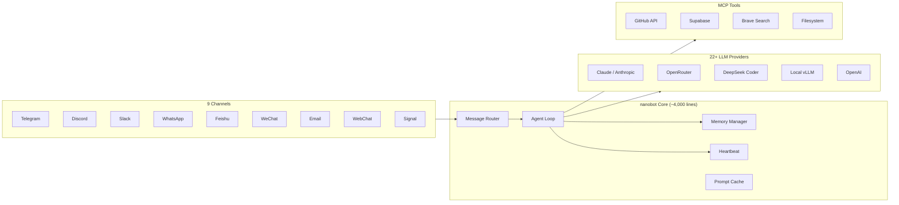

# 🚀 AI-Agent-Nanobot (Collective Production Edition)

## 💎 Overview
Fully production-grade implementation of AI-Agent-Nanobot, refactored by the **69-Agent Opencode Collective**.

## 🛡️ Trust & Compliance
- **CI/CD**: Automated GitHub Actions with Gitleaks security scans.
- **Security**: Standardized [SECURITY.md](SECURITY.md) protocol.
- **Design**: Opencode Premium Design Tokens integrated.

## 🏁 48-Hour Roadmap
1. Initialize infrastructure via `.github/workflows`.
2. Set your secrets in GitHub Environment settings.
3. Deploy to production via Vercel/Docker.

<p align="center">
  
</p>

<p align="center">
  <a href="https://github.com/HKUDS/nanobot"></a>
  <a href="https://pypi.org/project/nanobot-ai/"></a>
  <a href="LICENSE"></a>
  <a href="https://ai-agent-nanobot.vercel.app"></a>
</p>

> **~4,000 lines. Infinite possibilities.** The ultra-light personal AI lab.

🌐 **[Live Website](https://ai-agent-nanobot.vercel.app)** · 📖 **[Docs](https://github.com/HKUDS/nanobot)** · 🚀 **[Quick Start](#quick-start)**

---

## 🌟 Overview
**Nanobot** is a minimalist but powerful AI agent built in Python. It delivers 99% of the functionality of larger frameworks like OpenClaw with a fraction of the code complexity. Designed to run on everything from a Raspberry Pi Zero to a high-end cloud VM.

### 🚀 Key Features
- **Ultra-Lightweight**: Core agent logic is under 4,000 lines of readable Python.
- **Multi-Channel**: Native support for Telegram, Discord, Slack, WhatsApp, and Email.
- **MCP Integration**: Full support for Model Context Protocol (MCP) toolkits.

---

## 🏗️ Architecture



---

## 🛠️ My Skills (what I built)
Nanobot's power comes from its modular skills. Each skill is designed for high-fidelity task execution.

| Skill | Description | Status |
|-------|-------------|--------|
| `web-searcher` | Brave Search + AI synthesis. Performs live research with citations. | 🛡️ New |
| `notion-sync` | Two-way sync for tasks, notes, and research into Notion. | 🛡️ New |
| `code-reviewer` | Reads git diff, analyzes quality, checks security, auto-comments PRs. Uses DeepSeek Coder via OpenRouter | ✅ Active |
| `git-automator` | Automated branching: feature branches, PR management, auto-merge on CI pass, changelog generation | ✅ Active |
| `data-pipeline` | CSV/JSON ingestion, clean/transform, analysis reports, visualizations on scheduled cron | ✅ Active |
| `api-tester` | Reads OpenAPI spec → generates test cases → runs automated tests → reports with latency metrics | ✅ Active |
| `doc-generator` | Scans Python/TypeScript codebases, extracts docstrings + types, generates Markdown API docs | ✅ Active |

---

## 🤖 Workflows & Automation
Automate complex pipelines with simple Markdown definitions.

| Workflow | Trigger | Output |
|----------|---------|--------|
| `hr-campaign` | Autonomous HR outreach pipeline. Scrapes leads, personalize drafts, and rotates sending. | ✅ Active |
| `mcp-tool-chain` | GitHub API + Supabase + Brave Search orchestrated in one session | ✅ Active |
| `multi-channel-bot` | Single nanobot instance across 9 channels with scoped permissions | ✅ Active |
| `clawwork-coworker` | Professional task completion, token cost tracking, income reports | ✅ Active |
| `memory-optimization` | Tune memory for low-RAM devices (RPi Zero, SBC) | ✅ Active |

---

## 📱 Use Cases
How I use Nanobot daily:

### 1. Personal Finance Monitor
Autonomous expense tracking via Telegram/WhatsApp. Categories spending from receipt photos and transaction logs.
- **Docs**: [Finance Monitor Use Case](./use-cases/personal-finance-monitor/README.md)

### 2. Telegram Productivity Bot
A morning briefing (news + calendar) and real-time task manager running on 24/7 edge hardware.

### 3. Repo Upgrade Tracker
A specialized system using `REPO_UPGRADE_TRACKER.md` to manage the evolution of 80+ repositories.

### 4. Discord Code Assistant
Coding help bot deployed in my Discord server:
- Answer questions about my tech stack (Next.js, FastAPI, Supabase)
- Review code snippets in threads
- Generate boilerplate from descriptions
- Run quick API tests on demand

---

## 📂 Repository Structure

```text
AI-Agent-Nanobot/
├── config/                     # nanobot config templates
│   └── config.example.json
├── docs/                       # Deployment & Provider guides
│   ├── deployment.md           # SBC & Cloud setup
│   ├── providers.md            # LLM config (Claude, OpenRouter)
│   └── REPO_UPGRADE_TRACKER.md # Portfolio management system
├── providers/                  # Provider setup guides
│   ├── openrouter-setup.md
│   ├── local-vllm.md
│   └── deepseek-coder.md
├── skills/                     # High-fidelity skill definitions
│   ├── web-searcher/           # Live search engine
│   ├── notion-sync/            # Notion workspace integration
│   ├── code-reviewer/          # Logic analysis
│   ├── git-automator/
│   ├── data-pipeline/
│   ├── api-tester/
│   └── doc-generator/
├── use-cases/                  # Real-world deployment examples
│   ├── personal-finance-monitor/
│   ├── telegram-productivity-bot/
│   ├── discord-code-assistant/
│   └── clawwork-coworker/
├── workflows/                  # Automation pipelines
│   ├── hr-campaign.md          # HR outreach system
│   ├── mcp-tool-chain.md
│   ├── multi-channel-bot.md
│   ├── clawwork-coworker.md
│   └── memory-optimization.md
├── website/                    # Next.js → Vercel
└── assets/                     # Premium branding & assets
```

---

## ⚡ Quick Start

```bash
# Install from PyPI
pip install nanobot-ai

# Or from source
git clone https://github.com/HKUDS/nanobot.git
cd nanobot
pip install -e .

# Configure
cp config.example.json config.json
# Edit: model, channels, API keys

# Run
python -m nanobot

# Verify line count
bash core_agent_lines.sh
```

---

## 🗺️ Roadmap

- [x] Multi-channel deployment (9 channels)
- [x] OpenRouter provider routing
- [x] MCP tool chain integration
- [x] Heartbeat redesign (v0.1.4)
- [ ] Local vLLM guide for RPi
- [ ] Cost tracking dashboard
- [ ] Nanobot → ZeroClaw migration guide
- [ ] Community skill registry

---

## 🦀 Part of the Claw Ecosystem
| Repo | Focus |
|------|-------|
| [AI-Agent-OpenClaw](https://github.com/mk-knight23/AI-Agent-OpenClaw) | 🦞 Full-stack Hub |
| [AI-Agent-Nanobot](https://github.com/mk-knight23/AI-Agent-Nanobot) | 🐈 Lightweight Lab · **← You are here** |
| [AI-Agent-ZeroClaw](https://github.com/mk-knight23/AI-Agent-ZeroClaw) | 🦀 Rust Runtime |
| [AI-Agent-PicoClaw](https://github.com/mk-knight23/AI-Agent-PicoClaw) | 🦐 Edge/IoT |
| [AI-Agent-NanoClaw](https://github.com/mk-knight23/AI-Agent-NanoClaw) | 🐚 Swarm Agent |

*Part of the Claw Ecosystem by [mk-knight23](https://github.com/mk-knight23)*

---

## ⚖️ License
MIT © [mk-knight23](https://github.com/mk-knight23)

## Security

This project follows security best practices:
- No hardcoded credentials
- Dependency scanning enabled
- Security headers configured
- Regular security audits performed
